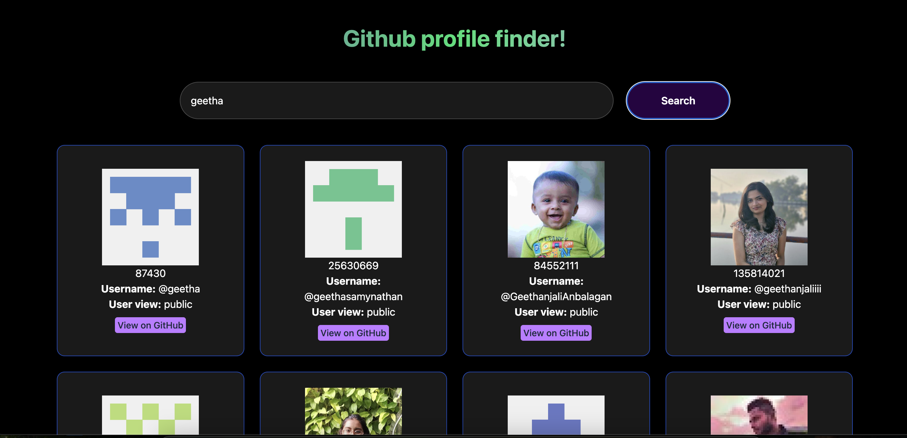

# 🔍 GitHub Profile Finder App

A simple web application that allows users to search for GitHub profiles and display them as responsive cards using the GitHub REST API.

---

## 🚀 What This App Does

- Takes a username input from the user  
- Searches GitHub users matching the input  
- Displays user profiles as cards  
- Shows profile image, username, and GitHub link  
- Automatically arranges cards in rows using a responsive grid layout  

---

## 🛠️ Tech Stack Used

- HTML  
- JavaScript (Fetch API)  
- Tailwind CSS  
- GitHub REST API  

---

## 🔗 APIs Used

### Search GitHub Users API

- https://api.github.com/users/sidhgeetha
- https://api.github.com/search/users?q={username}

